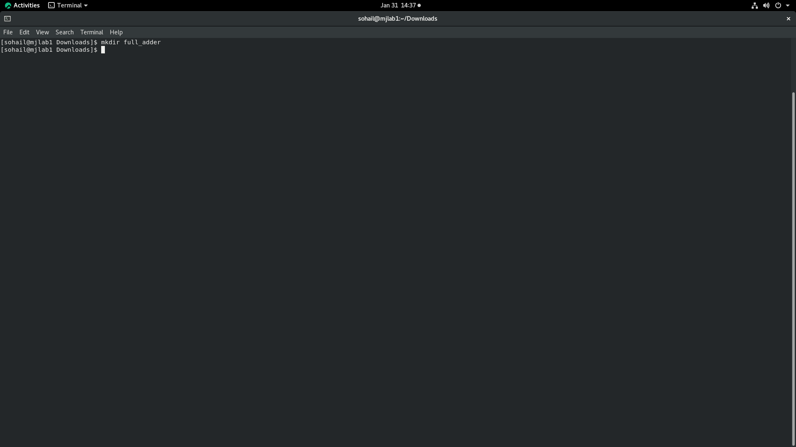

# FULL ADDER RTL TO GDSII

This document describes the complete **VLSI Flow** of a full adder using **Synopsys VCS VERDI & Design Compiler and ICC2** with **SAED 32nm PDK**.

---

## Simulation

###  xxxxxx

```
mkdir full_adder
```



---
