# FULL ADDER RTL TO GDSII

This document describes the complete **VLSI Flow** of a full adder using **Synopsys VCS VERDI & Design Compiler and ICC2** with **SAED 32nm PDK**.

---

###  xxxxxx

```
mkdir full_adder
```


```
cd full_adder/
```
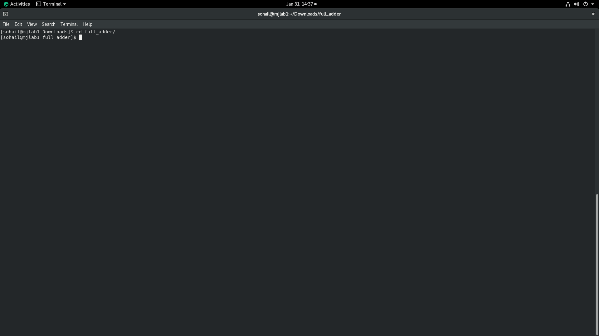

```
mkdir rtl sim tb
```
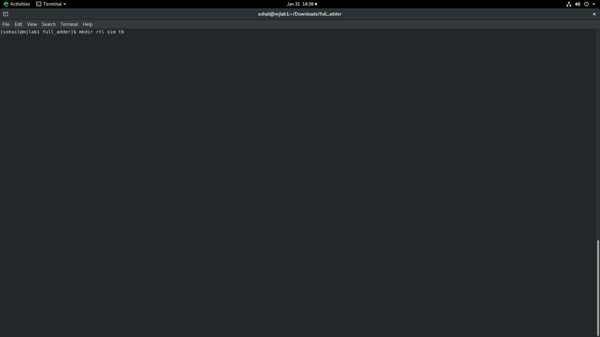

```
cd rtl
```
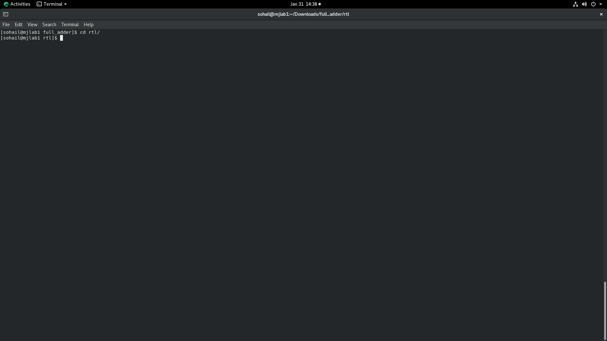

```
gedit full_adder.v
```
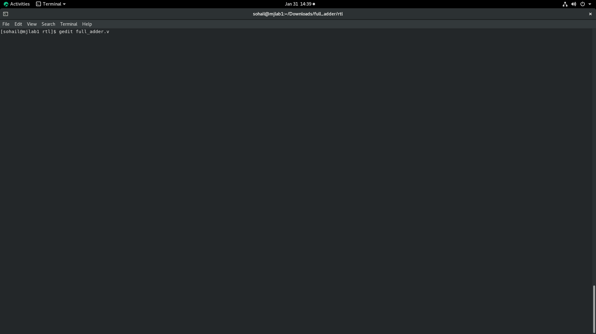

```
cd ..
```
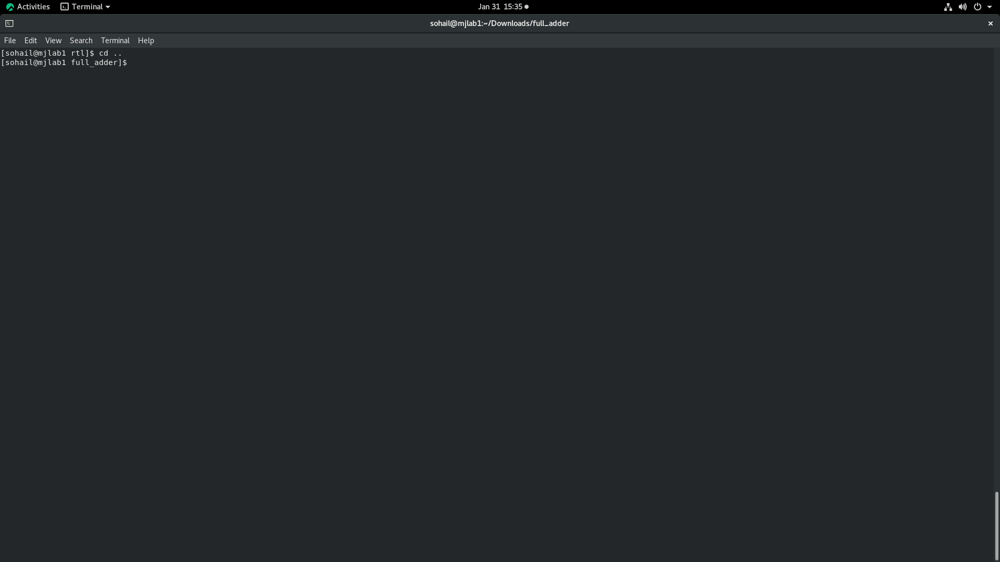

```
cd tb/
```
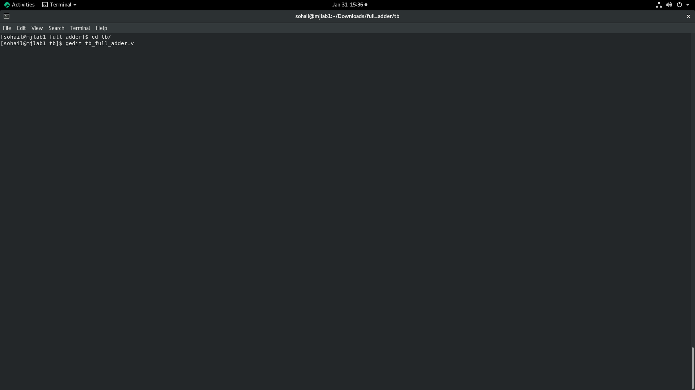

```
gedit tb_full_adder.v
```


```
cd ..
```
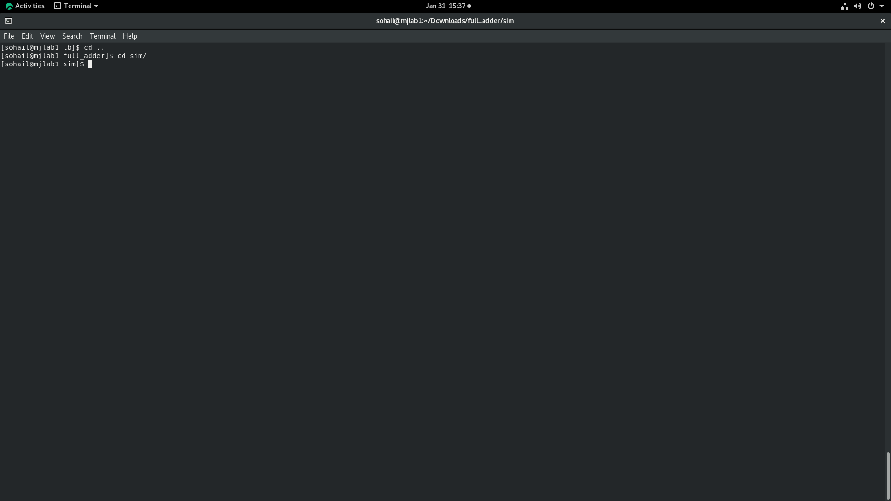

```
cd sim/
```


```
vcs ./../rtl/full_adder.v ./../tb/tb_full_adder.v -lca -kdb -debug_access+all -full64
```
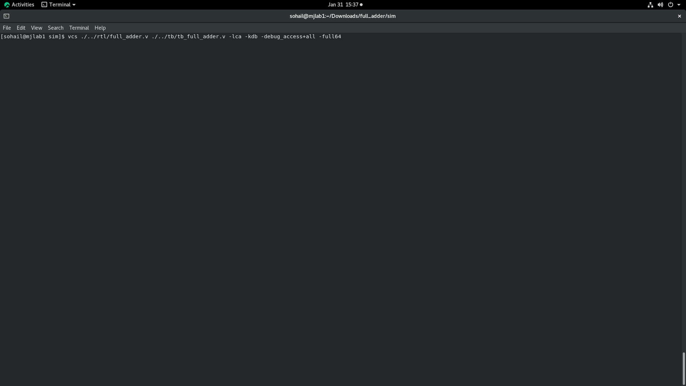


### vcs result

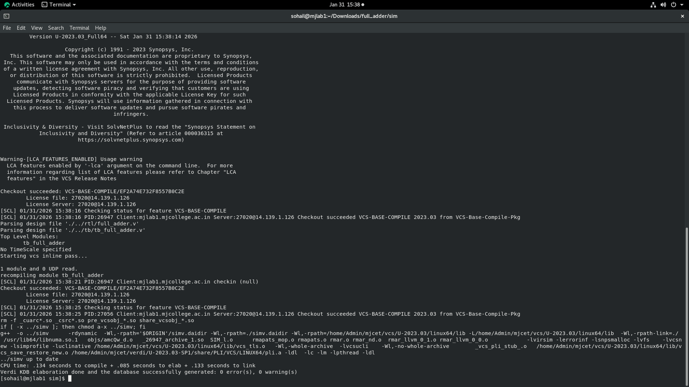

```
ls
```
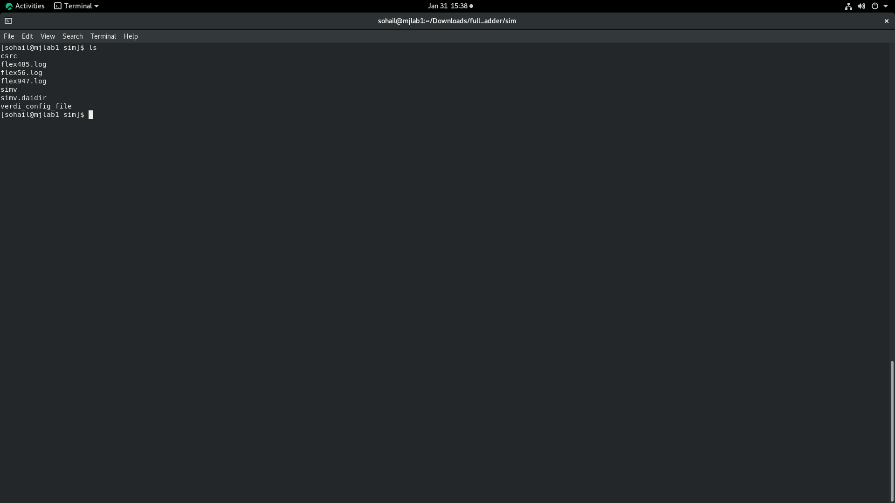


```
./simv
```
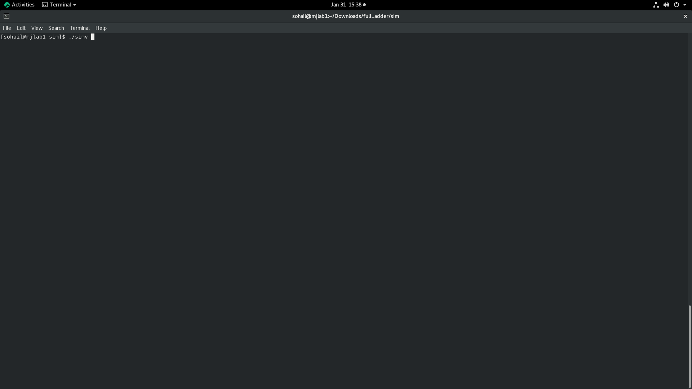

```
./simv -verdi &
```
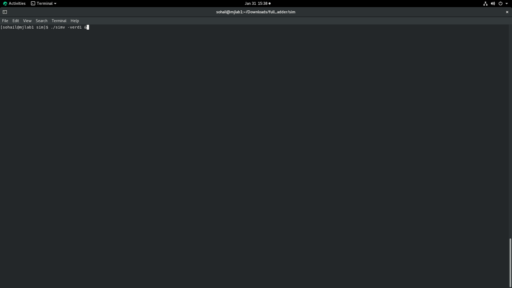

### Simulation Results
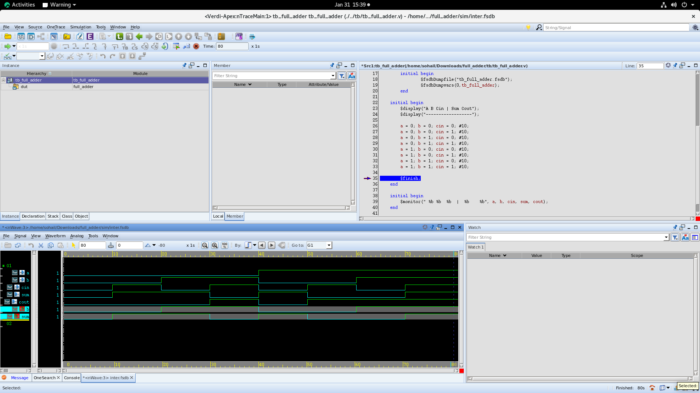
